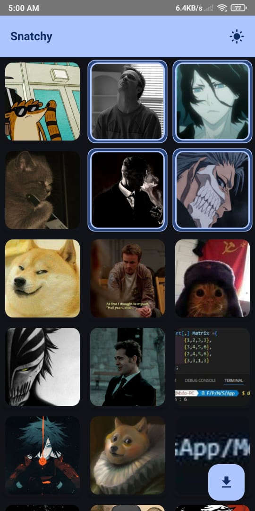

# Snatchy

Snatchy is a lightweight Android app designed to effortlessly download and save WhatsApp photo and video statuses.

## Features by Version

- **v0.2**: View photo and video statuses 📸🎥
- **v0.3**: Swipe to refresh the status list 🔄
- **v0.8**: Download selected statuses with a single tap ⬇️
- **Coming Soon (v2.0)**: Support for Telegram statuses ISA

## How to Use

1. View the status in WhatsApp 👀
2. Open Snatchy to find the available statuses 📂
3. Tap to download your favorites 👍

## Download the Latest Version

To download the latest version of the Snatchy app:

1. Go to the [Releases](https://github.com/BERLINx03/snatchy/releases) page.
2. Download the APK file for the latest release.
3. Install the APK on your Android device.

> **Note:** You might need to enable installation from unknown sources in your device settings.

## Tech Stack
- **Framework**: Android Jetpack Compose 🚀
- **Storage**: Local file system with media store💾
