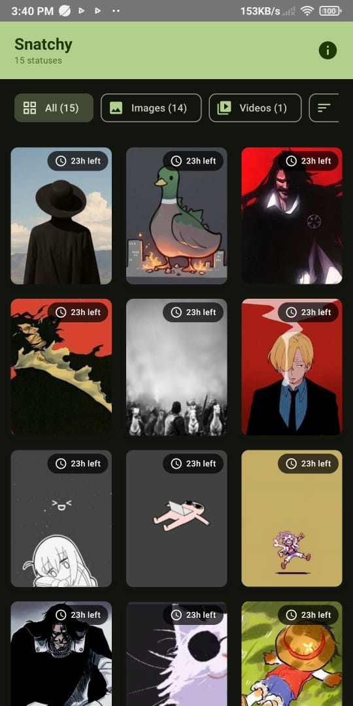

# Snatchy

Snatchy is a lightweight Android app designed to effortlessly download and save WhatsApp photo and video statuses.

  
  

## Requirements

- Android 6.0+ (API level 23 or higher)
- WhatsApp installed on your device

## How to Use

### Step 1: Grant Permissions

When you first open Snatchy, you'll need to grant storage permissions:

**For Android 11+ (API 30+):**

1. Tap "Allow" when prompted for media permissions

   

2. If you accidentally denied permissions, you can enable them later in:
    - **Settings** → **Apps** → **Snatchy** → **Permissions** → **Files and media** → **Allow**

   

**For Android 6 - 10:**

1. Tap "Allow" when prompted for storage permissions

   

2. If needed, enable permissions later in:
    - **Settings** → **Apps** → **Snatchy** → **Permissions** → **Storage** → **Allow**

### Step 2: Download Statuses

1. View the status in WhatsApp 👀
2. Open Snatchy to find the available statuses 📂
3. Tap to select and download your favorites 👍

### Step 3: Access Your Downloads

Your downloaded statuses are saved to:
- **Photos**: `Pictures/Snatchy`
- **Videos**: `Movies/Snatchy`

*If you see this screen, make sure you've viewed some statuses in WhatsApp first!*

## Download the Latest Version

To download the latest version of the Snatchy app:

1. Go to the [Releases](https://github.com/BERLINx03/snatchy/releases) page.
2. Download the APK file for the latest release.
3. Install the APK on your Android device.

> **Note:** You might need to enable installation from unknown sources in your device settings.

## Features

✨ Simple and intuitive interface  
📸 Download photo statuses  
🎥 Download video statuses  
🌓 Dark mode support  
💾 Automatic gallery organization

## Tech Stack

- **Framework**: Android Jetpack Compose 
- **Storage**: Local file system with MediaStore 
- **Coroutines**: Flow for async operations ⚡

## Privacy

Snatchy only accesses WhatsApp status files stored locally on your device. No data is collected or sent to any server.

## License

This project is for educational purposes only.